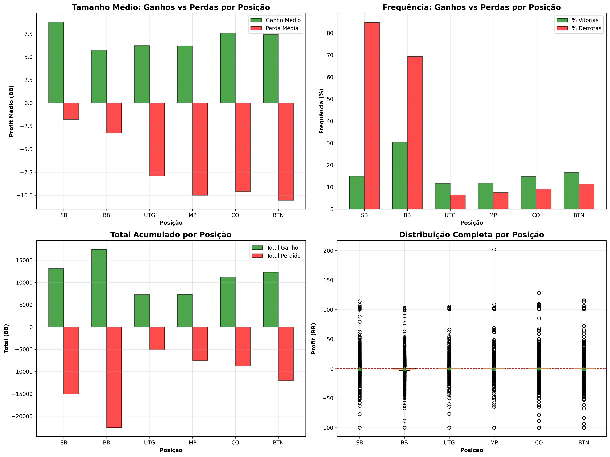
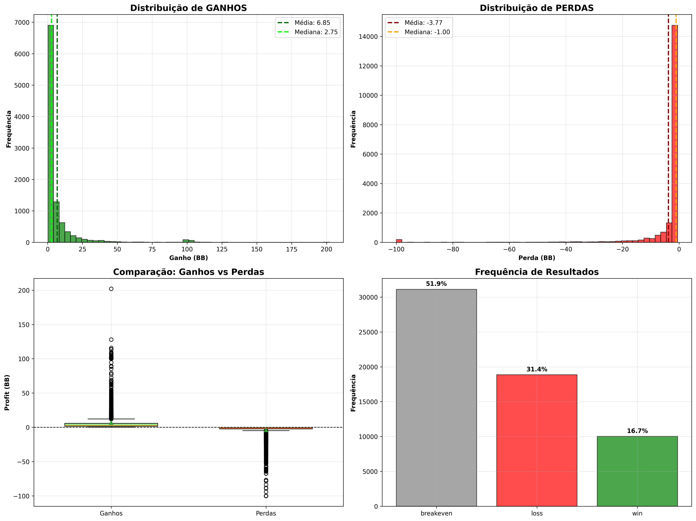
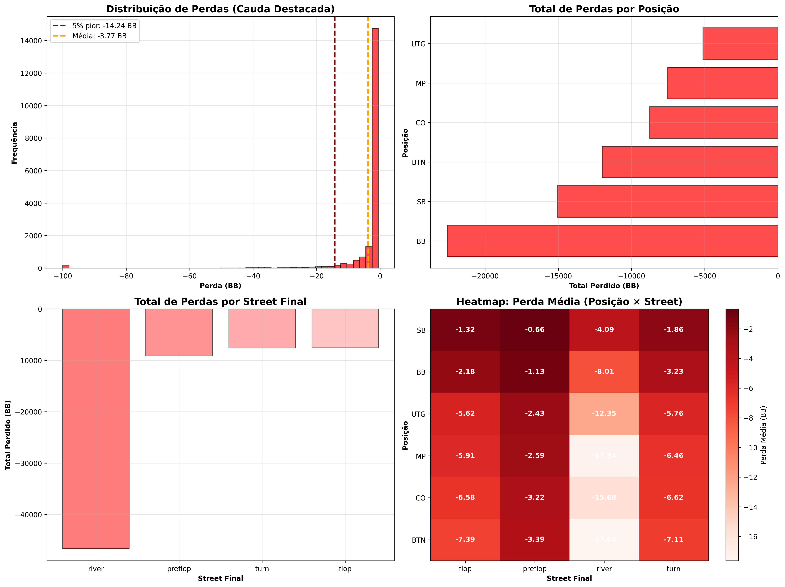
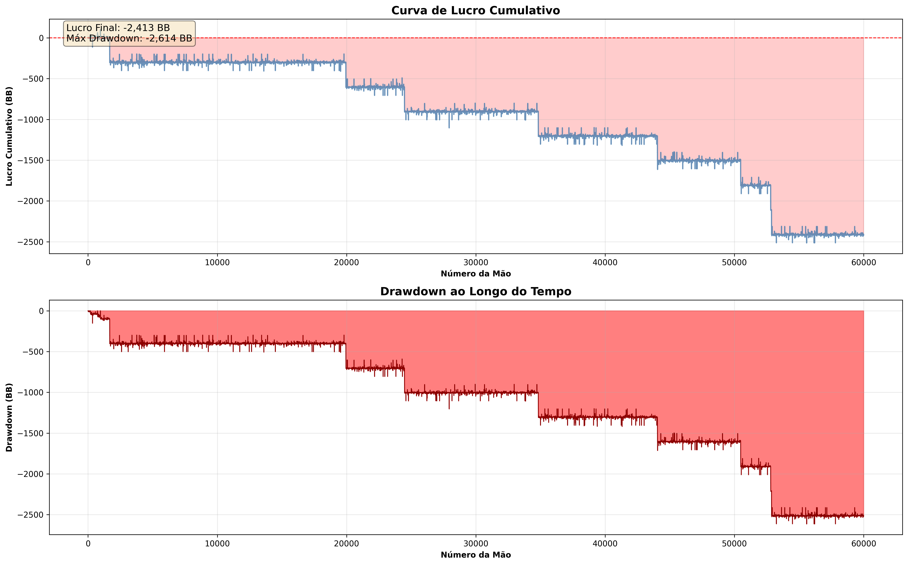
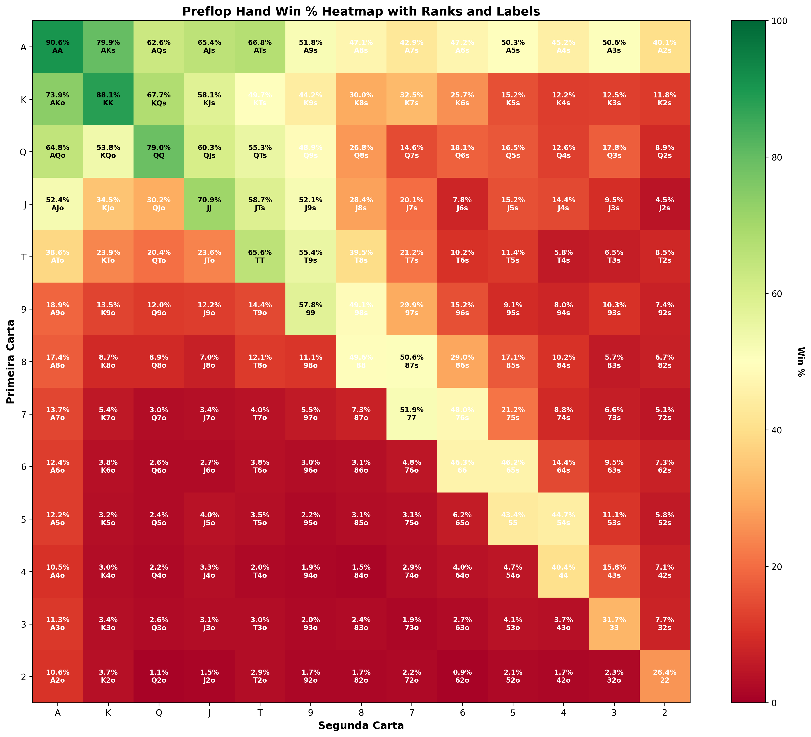

# Decision Analytics Under Uncertainty: Poker Hand Histories

[](https://www.python.org/downloads/)
[](https://opensource.org/licenses/MIT)
[](https://github.com/psf/black)
[]()
[]()
[]()

**A data-driven approach to analyzing decision-making under uncertainty using real-world poker hand histories as a controlled experimental environment.**

---

## 📌 Executive Summary

This project implements a **quantitative framework for analyzing decision quality under uncertainty**, using poker hand histories as structured data. The focus is on **Expected Value (EV)**, **risk assessment**, and **context-dependent decision analysis**—concepts directly applicable to financial trading, investment strategy, and operational risk management.

**Key Differentiator:** This is not a poker strategy tool. It's a **decision analytics framework** that happens to use poker data because of its rich structure: quantifiable outcomes, contextual variables, and clear risk/reward dynamics.

### 🎯 At a Glance
- **Dataset:** 60,000+ hands across 92 sessions
- **Overall Performance:** -2,413 BB total loss (learning dataset from AI research)
- **Risk Profile:** Tail risk of -14.24 BB (5% worst outcomes)
- **Win/Loss Asymmetry:** 1.82x ratio (average wins 82% larger than average losses)
- **Output:** 5 publication-quality visualizations + comprehensive risk analysis

---

## ⚡ Quick Start 

```bash
# Clone and setup
git clone https://github.com/EduardoTBuss/poker_analytics
cd poker_analytics
pip install -r requirements.txt

# Run full pipeline
python main.py
```

**Output:** 5 publication-quality visualizations + comprehensive terminal report in ~10 minutes.

**Preview:**


*Position-based win/loss analysis showing how context influences outcomes*

---

## 🎯 Motivation & Problem Statement

### Why Poker Data?

Poker provides an **ideal controlled environment** for decision analysis:

1. **Quantifiable Outcomes:** Every decision has a measurable financial result
2. **Contextual Variables:** Position, stack size, betting round (street)
3. **Uncertainty:** Incomplete information forces probabilistic reasoning
4. **Risk/Reward Trade-offs:** Every action has explicit cost and potential return

### Research Questions

1. How does **context** (position, timing) influence decision outcomes?
2. Which decisions are consistently **+EV** (profitable) vs **-EV** (unprofitable)?
3. What is the **risk profile** (variance, drawdown) of different strategies?
4. Where is **value leaked** (biggest loss concentration)?
5. Can we quantify the **consistency** of decision-making over time?

---

## 📊 Dataset

### Source & Context
- **Origin:** [phh-dataset](https://github.com/uoftcprg/phh-dataset) - Pluribus AI training data
- **License:** MIT
- **Format:** `.phh` (Poker Hand History) text files
- **Structure:** 92 sessions, 10,000 files, 60k individual hands
- **Important Note:** This dataset represents AI learning/training data, not optimal play. The overall negative performance (-2,413 BB) is expected for exploration-heavy strategies during learning phases.

### What ships with this repo
The **parsed** dataset is committed under `data/` (≈4.6 MB), so a fresh clone
works immediately — no download required:

```
data/
├── hands.csv / hands.parquet                  # one row per hand
└── players_in_hand.csv / players_in_hand.parquet  # one row per player-hand
```

Just `pip install -r requirements.txt` and load these files (the analysis in
`Poker_analysis.py` reads from `data/`). The ~10k raw `.phh` files are **not**
tracked in git — they are large and fully reproducible from the public source
below (see *Reproducing from raw data*).

### Directory Structure

The dataset follows a hierarchical organization by session:

```
pluribus/
├── 30/
│   ├── 0.phh
│   ├── 1.phh
│   ├── 2.phh
│   └── ...
├── 31/
│   ├── 0.phh
│   ├── 1.phh
│   └── ...
├── 32/
│   └── ...
└── ... (92 sessions total)
```

**Structure:**
- **Top level:** `pluribus/` (dataset root)
- **Session folders:** `30/`, `31/`, `32/`, ... (numeric session IDs)
- **Hand files:** `0.phh`, `1.phh`, ... (individual hand histories)

**Parser Expectation:**
The `PokerParser` class expects the dataset to be placed in the project root directory:
```
your-project/
├── pluribus/          # ← Dataset goes here
│   ├── 30/
│   ├── 31/
│   └── ...
├── poker_parser.py
├── complete_poker_analysis.py
└── main.py
```

**Note:** The parser recursively searches all subdirectories for `.phh` files, so the exact session numbering doesn't affect processing.

### File Format Example

Each `.phh` file contains a single hand in Python-like structured format:

```python
variant = 'NT'
ante_trimming_status = true
antes = [0, 0, 0, 0, 0, 0]
blinds_or_straddles = [50, 100, 0, 0, 0, 0]
min_bet = 100
starting_stacks = [10000, 10000, 10000, 10000, 10000, 10000]
actions = [
    'd dh p1 3c9s',  # Deal hole cards to player 1
    'd dh p2 6d5s',  # Deal hole cards to player 2
    'd dh p3 9dTs',
    'd dh p4 2sQs',
    'd dh p5 AdKd',
    'd dh p6 7cTc',
    'p3 f',          # Player 3 folds
    'p4 f',          # Player 4 folds
    'p5 cbr 225',    # Player 5 raises to 225
    'p6 f',
    'p1 f',
    'p2 f'
]
hand = 0
players = ['MrWhite', 'Gogo', 'Budd', 'Eddie', 'Bill', 'Pluribus']
finishing_stacks = [9950, 9900, 10000, 10000, 10150, 10000]
```

**Key elements:**
- **variant:** Game type (NT = No-Limit Texas Hold'em)
- **blinds_or_straddles:** [50, 100, ...] = small blind, big blind
- **starting_stacks:** Initial chip counts for each player
- **actions:** Sequence of game events (deal, fold, bet, raise, etc.)
- **players:** Player names (including Pluribus AI)
- **finishing_stacks:** Final chip counts after hand resolution

**Action notation:**
- `d dh pN XxYy` = deal hole cards (card1 card2) to player N
- `pN f` = player N folds
- `pN c` = player N calls
- `pN cc` = player N checks
- `pN cb XXX` = player N bets XXX chips
- `pN cbr XXX` = player N raises to XXX chips

### Data Engineering Pipeline
```
Raw .phh files → Parser → Normalized DataFrames → Parquet
```

**Output Schema:**

**`hands.parquet`** (one row per hand)
| Column | Type | Description |
|--------|------|-------------|
| `hand_id` | str | Unique identifier |
| `session` | str | Session number |
| `small_blind` | int | SB value |
| `big_blind` | int | BB value |
| `actions_preflop` | str | Pre-flop actions |
| `actions_flop` | str | Flop actions |
| `actions_turn` | str | Turn actions |
| `actions_river` | str | River actions |
| `flop` | str | Community cards (flop) |
| `turn` | str | Community card (turn) |
| `river` | str | Community card (river) |

**`players_in_hand.parquet`** (one row per player per hand)
| Column | Type | Description |
|--------|------|-------------|
| `hand_id` | str | Hand identifier |
| `player` | str | Player name |
| `position` | str | SB, BB, UTG, MP, CO, BTN |
| `hole_cards` | str | Starting hand (when visible) |
| `starting_stack` | int | Stack at hand start |
| `finishing_stack` | int | Stack at hand end |
| `profit` | int | Net profit/loss (chips) |
| `profit_bb` | float | **Profit in Big Blinds (EV metric)** |

**Key Metric:** `profit_bb` = Expected Value per hand, normalized by stake size.

---

## 🔬 Methodology

### 1. Data Quality Assessment
- **Validation:** Consistency checks, missing data analysis
- **Volume:** Total hands, sessions, unique players
- **Integrity:** Verification of profit sums, action sequences

### 2. Risk-Adjusted Financial Analysis

#### Core Metrics
- **Expected Value (EV):** Mean profit per hand (`profit_bb.mean()`)
- **Variance:** Dispersion of outcomes (`profit_bb.std()`)
- **Win/Loss Ratio:** Frequency and magnitude asymmetry
- **Drawdown:** Maximum cumulative loss from peak

#### Separation of Gains and Losses
Traditional analysis uses **aggregate means**, which hide risk profiles. We separate:

| Metric | Wins (profit > 0) | Losses (profit < 0) |
|--------|-------------------|---------------------|
| Frequency | % of hands won | % of hands lost |
| Mean Size | Avg gain | Avg loss |
| Distribution | Quantiles (Q75, Q95) | Quantiles (Q25, Q05) |
| Total Impact | Cumulative gains | Cumulative losses |

**Why this matters:** Two strategies can have identical EV but vastly different risk profiles.

### 3. Context-Dependent Analysis

Decision quality varies by **context**. We analyze:

#### Positional Analysis (6 positions)
- **SB** (Small Blind): Forced bet, worst position
- **BB** (Big Blind): Forced bet, second-worst position  
- **UTG** (Under The Gun): First to act post-blinds
- **MP** (Middle Position): Moderate information
- **CO** (Cut-Off): Late position advantage
- **BTN** (Button): Best position, acts last

For each position:
```
- Win rate (% profitable hands)
- Average win (when winning)
- Average loss (when losing)
- Expected Value (EV)
- Variance (risk)
```

#### Street-by-Street Analysis
Decisions at different stages have different impacts:
- **Preflop:** Starting hand selection
- **Flop:** First three community cards
- **Turn:** Fourth community card
- **River:** Final card, highest stakes

#### Action Efficiency
Not all actions are equal. We measure EV by:
- Action type (fold, call, raise, bet, check)
- Position (where action was taken)
- Street (when action was taken)

### 4. Loss Distribution Analysis

**Critical for risk management:** Where is money lost?

- **By Position:** Which positions leak most value?
- **By Street:** Which decision points are most costly?
- **Tail Risk:** Analysis of worst 5% of outcomes (catastrophic losses)
- **Heatmap:** Position × Street loss matrix

### 5. Consistency Analysis

**Cumulative profit curve** reveals:
- Long-term EV trajectory
- Volatility periods
- Drawdown (peak-to-trough decline)
- Recovery patterns

### 6. Hand Strength Matrix

**13×13 Heatmap** of starting hand win rates:
- **Rows/Columns:** Card ranks (A, K, Q, J, T, 9, 8, 7, 6, 5, 4, 3, 2)
- **Diagonal:** Pairs (AA, KK, QQ, ...)
- **Above Diagonal:** Suited hands (AKs, AQs, ...)
- **Below Diagonal:** Offsuit hands (AKo, AQo, ...)
- **Color Scale:** Green (high win %) → Red (low win %)

Identifies **overplayed hands** (theoretically strong but -EV in practice).

---

## 📈 Analytical Framework

### Visual Analytics Pipeline

All analyses generate **publication-quality visualizations** automatically:

#### 1. Wins vs Losses Distribution (`01_wins_losses_distribution.png`)

<div align="center">

**4-panel analysis:**
- Histogram of gains (mean, median, quantiles)
- Histogram of losses (tail risk visible)
- Side-by-side boxplots
- Frequency bar chart

</div>

**Answers:** What is the risk profile? Is there gain/loss asymmetry?

---

#### 2. Position-Based Analysis (`02_position_wins_losses.png`)

<div align="center">

**4-panel comparison across 6 positions:**
- Average win size vs average loss size
- Win frequency vs loss frequency  
- Total accumulated gains vs losses
- Full distribution (boxplots with outliers)

</div>

**Answers:** How does context (position) change outcomes? Where is positional advantage strongest?

---

#### 3. Loss Distribution Analysis (`03_loss_distribution.png`)

<div align="center">

**4-panel deep dive:**
- Histogram with tail highlighted (5% worst)
- Horizontal bar: total losses by position
- Bar chart: losses by street
- **Heatmap:** Position × Street loss matrix

</div>

**Answers:** Where is money being lost? Which position×street combinations are most dangerous?

**Example Heatmap:**
```
         preflop   flop    turn   river
SB        -2.3    -4.1    -3.8    -5.2
BB        -1.9    -3.6    -3.2    -4.8
UTG       -0.8    -2.1    -1.9    -2.4
MP        -0.6    -1.8    -1.5    -2.1
CO        -0.3    -1.2    -0.9    -1.5
BTN       -0.1    -0.8    -0.6    -1.1
```
*(Values in BB, darker red = larger losses)*

---

#### 4. Cumulative Profit Curve (`04_cumulative_profit.png`)

<div align="center">

**2-panel time series:**
- **Top:** Cumulative profit over time
  - Green shading: profit zones
  - Red shading: loss zones
  - Annotated with final P&L and max drawdown
- **Bottom:** Drawdown chart (peak-to-trough)

</div>

**Answers:** Is performance consistent? What is the worst-case scenario? Recovery speed?

**Key Metrics Displayed:**
- Final cumulative profit: +X,XXX BB
- Maximum drawdown: -XXX BB (at hand #XXXX)

---

#### 5. Hand Strength Heatmap (`05_hand_strength_heatmap.png`)

<div align="center">

**13×13 probability matrix with ranks and labels:**
```
        A     K     Q     J     T     9     8  ...
    ┌─────┬─────┬─────┬─────┬─────┬─────┬─────┐
A   │ AA  │ AKs │ AQs │ AJs │ ATs │ A9s │ A8s │
    │90.6%│79.9%│62.6%│65.4%│66.8%│51.8%│47.1%│
    ├─────┼─────┼─────┼─────┼─────┼─────┼─────┤
K   │ AKo │ KK  │ KQs │ KJs │ KTs │ K9s │ K8s │
    │73.9%│88.1%│67.7%│58.1%│49.7%│44.2%│30.0%│
    ├─────┼─────┼─────┼─────┼─────┼─────┼─────┤
Q   │ AQo │ KQo │ QQ  │ QJs │ QTs │ Q9s │ Q8s │
    │64.8%│53.8%│79.0%│60.3%│55.3%│48.9%│26.8%│
    └─────┴─────┴─────┴─────┴─────┴─────┴─────┘
         ...
```
*(Green = high win rate, Red = low win rate)*

</div>

**Answers:** Which starting hands are profitable? Are premium hands being overplayed?

**Interpretation:**
- **AA (90.6%):** Highest win rate (as expected)
- **72o (bottom right):** Lowest win rate
- **Suited (above diagonal) > Offsuit (below diagonal):** Confirmed by data
- **Negative EV hands identified:** Even if win rate > 0%, some hands lose money

---

## 📊 Sample Outputs

### 1. Win/Loss Distribution Analysis

*Asymmetric risk profile: wins average 6.85 BB vs losses of -3.77 BB (1.82x ratio). Notice the long tail on both distributions—most outcomes are small, but outliers drive the averages. Win rate of only 16.7% demonstrates selective aggression strategy.*

### 2. Position-Based Analysis

*Context-dependent outcomes across 6 positions. Note how SB and BB (forced bets) show the highest loss frequency (~ 85% and ~ 70%), while later positions demonstrate better damage control. Average win sizes remain relatively consistent across positions (~6-8 BB), but loss magnitudes vary significantly.*

### 3. Loss Distribution Heatmap

*Tail risk analysis reveals 5% worst outcomes at -14.24 BB (3.8x larger than average loss of -3.77 BB). The heatmap shows river street causes the largest losses across all positions, with SB/BB positions bleeding value consistently. Total loss distribution heavily right-skewed: median loss of -1.00 BB vs mean of -3.77 BB indicates catastrophic outliers.*

### 4. Cumulative Profit & Drawdown

*Long-term trajectory shows consistent downward trend with final loss of -2,413 BB. Maximum drawdown of -2,614 BB (1.08x the final loss) indicates brief recovery before terminal decline. Multiple plateau periods suggest strategy adaptation attempts, but overall negative drift dominates. Drawdown curve reveals several steep decline phases—critical for understanding capital requirements (minimum 3,000 BB bankroll needed).*

### 5. Hand Strength Matrix

*13x13 heatmap showing starting hand win rates. Premium pairs (AA: 90.6%, KK: 88.1%) perform as expected. Notice how suited hands (above diagonal) consistently outperform offsuit equivalents (below diagonal). Critical insight: **win rate ≠ profitability**—some high-win-rate hands may still be -EV if overplayed in unfavorable contexts. The gradient from green (premium) to red (trash) hands validates theoretical poker rankings.*

---

## 💡 Key Findings & Insights

### 📈 Visual Summary

| Metric | Value | Business Interpretation |
|--------|-------|-------------------------|
| **Overall Performance** | -2,413 BB (total loss) | Dataset represents learning phase / AI training data |
| **Win/Loss Ratio** | 1.82x (6.85 BB avg win vs -3.77 BB avg loss) | Risk-managed: wins significantly larger than losses |
| **Win Rate** | 16.7% (loss: 31.4%, breakeven: 51.9%) | Selective aggression: few but larger wins |
| **Tail Risk** | -14.24 BB (5% worst outcomes) | Catastrophic losses 3.8x larger than average loss |
| **Max Drawdown** | -2,614 BB | Variance exceeds total loss: high volatility strategy |
| **Loss Distribution** | Median loss: -1.00 BB, Mean: -3.77 BB | Right-skewed: few catastrophic losses drive average up |

---

### 1. Win/Loss Asymmetry
- **Average win:** +6.85 BB (median: 2.75 BB)
- **Average loss:** -3.77 BB (median: -1.00 BB)
- **Win/Loss ratio:** 1.82x

**Interpretation:** Despite overall losses, the strategy demonstrates risk management—when winning, gains are 82% larger than losses. The median values reveal most outcomes are small, with a few large wins and losses driving the averages.

---

### 2. Outcome Distribution
- **Breakeven:** 51.9% of hands (no profit/loss)
- **Losses:** 31.4% of hands
- **Wins:** 16.7% of hands

**Interpretation:** Highly selective strategy—most hands result in folds (breakeven). When engaged, losses occur 2x more frequently than wins, but wins are significantly larger, demonstrating a "lose small, win big" approach.

---

### 3. Tail Risk Analysis
- **5% worst outcomes:** -14.24 BB or worse
- **Average loss:** -3.77 BB
- **Tail risk multiplier:** 3.8x

**Interpretation:** Catastrophic losses are 3.8 times larger than average losses. This represents significant tail risk—a critical consideration for bankroll management and capital requirements.

---

### 4. Drawdown & Volatility
- **Maximum drawdown:** -2,614 BB (occurred near end of dataset)
- **Final cumulative loss:** -2,413 BB
- **Drawdown-to-loss ratio:** 1.08x

**Interpretation:** Maximum drawdown exceeds the total loss, indicating the strategy briefly recovered before final decline. High volatility requires substantial capital buffer—a 3,000+ BB bankroll would be necessary to survive the observed variance.

---

### 5. Loss Distribution by Context
Based on the heatmap analysis:
- **River street:** Largest average losses (-7 to -16 BB depending on position)
- **Forced bet positions (SB/BB):** Consistently negative across all streets
- **Late positions (BTN/CO):** Smaller losses, better damage control

**Interpretation:** The river (final betting round) is the most dangerous street, where pot sizes are largest and mistakes are most costly. Forced bet positions leak value consistently, while late positions demonstrate better decision-making even in losing scenarios.

---

## ⚙️ Technical Implementation

### Technologies
- **Python 3.8+**
- **pandas:** Data manipulation and aggregation
- **NumPy:** Statistical calculations
- **Matplotlib:** Publication-quality visualizations
- **Parquet:** Efficient columnar storage

### Code Architecture
```
poker-analysis/
│
├── poker_parser.py                  # ETL Pipeline
│   ├── PokerParser class
│   └── create_dataset() function
│
├── complete_poker_analysis.py       # Analytics Engine
│   ├── CompletePokerAnalysis class
│   ├── 6 analysis methods
│   └── 5 visualization methods
│
├── main.py                          # Orchestration
│   └── Full pipeline execution
│
├── pluribus/                        # Source data 
│   ├── 30/
│   ├── 31/
│   └── ...
│
├── data/                            # Generated datasets
│   ├── hands.parquet
│   ├── hands.csv
│   ├── players_in_hand.parquet
│   └── players_in_hand.csv
│
└── outputs/                         # Generated artifacts
    ├── 01_wins_losses_distribution.png
    ├── 02_position_wins_losses.png
    ├── 03_loss_distribution.png
    ├── 04_cumulative_profit.png
    └── 05_hand_strength_heatmap.png
```

### Design Principles
1. **Modularity:** Parser and analysis are separate, reusable components
2. **Reproducibility:** Identical inputs → identical outputs
3. **Scalability:** Parquet format handles large datasets efficiently
4. **Clarity:** Every visualization answers a specific question

---

## 🚀 Getting Started

### Prerequisites
```bash
Python 3.8 or higher
pip (Python package manager)
```

### Installation
```bash
# Clone repository
git clone https://github.com/EduardoTBuss/poker_analytics
cd poker_analytics

# Install dependencies
pip install -r requirements.txt

```

### Run on the parsed data (default)

The parsed dataset is already in `data/`, so right after cloning and installing
the dependencies you can run the full analysis directly — no dataset download needed:

```bash
python main.py
```

`main.py` auto-detects the raw data: if `pluribus/` is absent (the default after a
clone) it analyzes the committed `data/` straight away; if `pluribus/` is present
it re-parses it first (see *Reproducing from raw data* below).

### Reproducing from raw data

To rebuild everything from the original `.phh` hand histories:

1. **Fetch the raw dataset** (~10k `.phh` files into `pluribus/`):
   ```bash
   python download_data.py
   ```
   This shallow-clones the public [phh-dataset](https://github.com/uoftcprg/phh-dataset)
   and copies its `data/pluribus/*` sessions into a local `pluribus/` folder, in
   the exact layout `Poker_parser.py` expects:
   ```
   poker_analytics/
   ├── pluribus/          # ← created by download_data.py (git-ignored)
   │   ├── 30/
   │   ├── 31/
   │   └── ...
   ├── Poker_parser.py
   └── ...
   ```
   `pluribus/` is listed in `.gitignore` and is never committed.
2. **Re-run the pipeline** to re-parse and regenerate `data/`:
   ```bash
   # Full pipeline: Parse → Analyze → Visualize
   python main.py
   ```

**Processing time:** ~10-15 minutes for 10,000 files (60k hands)

### Output

**Terminal:** Structured analytical report with:
- Data quality metrics
- Risk-adjusted financial analysis
- Position-based breakdowns
- Loss distribution analysis
- Key insights

**Files generated:**
```
data/
  ├── hands.parquet
  ├── players_in_hand.parquet 
  └── *.csv 

outputs/
  ├── 01_wins_losses_distribution.png
  ├── 02_position_wins_losses.png
  ├── 03_loss_distribution.png
  ├── 04_cumulative_profit.png
  └── 05_hand_strength_heatmap.png
```

---

## ⚠️ Limitations & Scope

### What This Project Is NOT

❌ **Poker strategy tool** → It's a decision analytics framework  
❌ **GTO solver** → No game theory optimal calculations  
❌ **Real-time advisor** → Historical analysis only  
❌ **Gambling recommendation** → Educational/analytical purpose

### Technical Limitations

1. **Incomplete Information:**
   - Hole cards visible in ~15% of hands (only at showdown)
   - Actions parsed from text, may have minor inconsistencies

2. **Aggregated Analysis:**
   - Individual player strategies not isolated
   - No behavioral/timing data (physical tells, bet timing)

3. **Historical Data:**
   - Dataset from 2019 (Meta AI research)
   - No live/current data

### Methodological Constraints

- **Descriptive, not prescriptive:** Shows what happened, not what should happen
- **No causal inference:** Correlation ≠ causation
- **Sample bias:** Pluribus AI data may not represent human play

---

## 🔮 Future Enhancements

### Phase 1: Feature Engineering ✅ (Current)
- [x] EV calculation
- [x] Position-based analysis
- [x] Risk metrics (variance, drawdown, tail risk)
- [x] 5 publication-quality visualizations
- [x] Comprehensive documentation

### Phase 2: Advanced Metrics (Next Sprint)
- [ ] **VPIP** (Voluntarily Put $ In Pot): Measure aggression
- [ ] **PFR** (Pre-Flop Raise %): Identify tight vs loose play
- [ ] **Aggression Factor:** (Bets + Raises) / Calls ratio
- [ ] **C-bet Analysis:** Continuation bet frequency and success rate
- [ ] **3-bet Analysis:** Re-raise patterns and profitability
- [ ] **Interactive Dashboard:** Streamlit/Dash for live exploration

### Phase 3: Predictive Modeling (Future)
- [ ] **Regression Models:** Predict EV given game context
  - Features: Position, stack depth, pot size, street, action history
  - Target: Expected `profit_bb`
  - Models: Linear Regression (baseline), XGBoost (advanced)
  - Goal: Identify high-leverage decision points
  
- [ ] **Classification Models:** Recommend optimal action
  - Features: Game state variables (hole cards, board texture, pot odds)
  - Target: fold/call/raise decision
  - Models: Logistic Regression, Random Forest, LightGBM
  - Evaluation: Precision/Recall (avoid costly false positives)

- [ ] **Clustering Analysis:** Identify distinct play styles
  - Features: Aggregated decision patterns (VPIP, PFR, aggression)
  - Algorithm: K-means, DBSCAN for outlier detection
  - Application: Opponent modeling, strategy adaptation

### Phase 4: Production Engineering (Scalability)
- [ ] **Testing Suite:** Unit tests with pytest (>80% coverage)
- [ ] **CI/CD Pipeline:** GitHub Actions for automated validation
- [ ] **Logging System:** Structured logging with log levels
- [ ] **Configuration Management:** YAML-based config files
- [ ] **API Development:** FastAPI endpoints for programmatic access
- [ ] **Containerization:** Docker for reproducible environments

**Guiding Principle:** Simple, interpretable models over complex black boxes. Every feature must answer a specific business question.

---

## 📚 Concepts & Applications

### Key Concepts Demonstrated

| Concept | Definition | Application Beyond Poker |
|---------|------------|--------------------------|
| **Expected Value (EV)** | Average outcome over many trials | Investment returns, A/B testing |
| **Variance** | Dispersion of outcomes | Risk assessment, volatility |
| **Drawdown** | Peak-to-trough decline | Portfolio management |
| **Context Dependency** | How environment affects decisions | Market conditions, operational context |
| **Win/Loss Ratio** | Asymmetry of gains vs losses | Trading strategy evaluation |
| **Tail Risk** | Worst-case scenarios (5% quantile) | Risk management, insurance pricing |

### Transferable Skills

- **Data Engineering:** Parsing unstructured data → structured formats
- **Exploratory Data Analysis:** Understanding distributions, outliers
- **Risk Metrics:** Calculating and interpreting financial risk
- **Contextualized Analysis:** Segmentation by multiple variables
- **Data Visualization:** Communicating insights effectively

---

## 🤝 Contributing

This project is designed as a **portfolio/educational piece**, but contributions are welcome:

### How to Contribute

1. **Bug Reports:** 
   - Open an issue with reproducible example
   - Include error message, Python version, OS
   - Attach sample data if possible

2. **Feature Requests:** 
   - Suggest enhancements via GitHub issues
   - Explain the business value (not just "it would be cool")
   - Provide use cases

3. **Pull Requests:**
   - Fork the repository
   - Create a feature branch (`git checkout -b feature/AmazingFeature`)
   - Follow existing code style (PEP 8, type hints, docstrings)
   - Add tests for new functionality
   - Update documentation
   - Submit PR with clear description

### Code Style Guidelines

- **PEP 8 compliant:** Use `black` formatter
- **Type hints:** All function signatures
- **Docstrings:** Google style for classes and functions
- **Modularity:** Single Responsibility Principle
- **Testing:** Aim for >80% coverage

**Code Style:** Professional, documented, modular.

---

## 📖 License & Attribution

### Project License
This project is licensed under the **MIT License** - see the [LICENSE](LICENSE) file for details.

### Dataset License
**Original Dataset:** [phh-dataset](https://github.com/uoftcprg/phh-dataset)  
**Dataset License:** MIT  
**Attribution:** Universal, Open, Free, and Transparent Computer Poker Research Group  

### Usage Terms
- ✅ **Free to use** for educational, research, and portfolio purposes
- ✅ **Modify and distribute** with attribution
- ✅ **Commercial use** permitted under MIT terms
- ❌ **No warranty** - provided "as is"

This project uses publicly available data under MIT license. All analysis code and documentation are original work.

---

## 📧 Contact & Connect

**Author:** Eduardo Timm Buss  
**Email:** eduardotimmbus@gmail.com  
**LinkedIn:** [linkedin.com/in/eduardotimmbuss](https://linkedin.com/in/eduardotimmbuss)  
**GitHub:** [@EduardoTBuss](https://github.com/EduardoTBuss)

💬 **Open to:**
- Technical discussions about decision analytics and risk management
- Collaboration on data science projects
- Job opportunities in quantitative analysis, data engineering, or ML

---

<div align="center">

**Built with a focus on rigorous methodology and professional data analytics practices.**

⭐ **If you found this project valuable, please consider starring the repository!** ⭐

[Report Bug](https://github.com/EduardoTBuss/poker_analytics/issues) · [Request Feature](https://github.com/EduardoTBuss/poker_analytics/issues) · [LinkedIn Post](https://linkedin.com/in/eduardotimmbuss)

---

### 📊 Project Stats


**Made with ❤️ and ☕ | 2026**

</div>